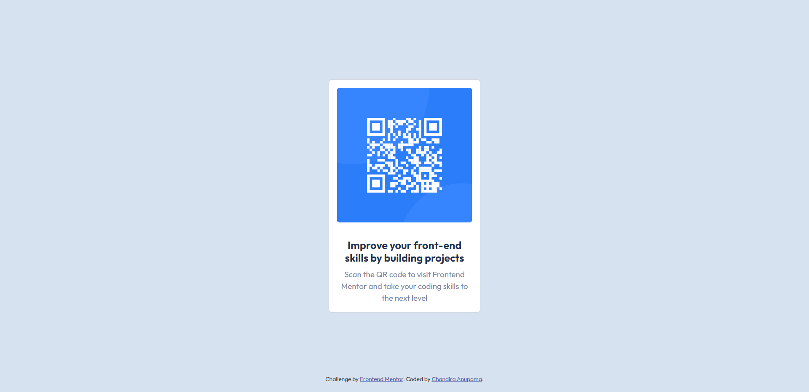

# Frontend Mentor - QR code component solution

This is a solution to the [QR code component challenge on Frontend Mentor](https://www.frontendmentor.io/challenges/qr-code-component-iux_sIO_H). Frontend Mentor challenges help you improve your coding skills by building realistic projects. 

## Table of contents

- [Overview](#overview)
  - [Screenshot](#screenshot)
  - [Links](#links)
- [My process](#my-process)
  - [Built with](#built-with)
  - [What I learned](#what-i-learned)
  - [Continued development](#continued-development)
  - [Useful resources](#useful-resources)
- [Author](#author)
- [Acknowledgments](#acknowledgments)

**Note: Delete this note and update the table of contents based on what sections you keep.**

## Overview

### Screenshot



### Links

- Solution URL: [Add solution URL here](https://github.com/chandiraanupamawca/qr-code-component)
- Live Site URL: [Add live site URL here](https://qr-code-component.chandiraanupama.repl.co)

## My process

### Built with

- Bootstrap 5 Cards

### What I learned

Use this section to recap over some of your major learnings while working through this project. Writing these out and providing code samples of areas you want to highlight is a great way to reinforce your own knowledge.

To see how you can add code snippets, see below:

```html
<div class="card position-absolute top-50 start-50 translate-middle" style="width: 19rem;">
```

### Continued development

Use this section to outline areas that you want to continue focusing on in future projects. These could be concepts you're still not completely comfortable with or techniques you found useful that you want to refine and perfect.

**Note: Delete this note and the content within this section and replace with your own plans for continued development.**

### Useful resources

- [Bootstrap CSS](https://getbootstrap.com/docs/5.2/getting-started/introduction/)
- [Bootstrap Cards](https://getbootstrap.com/docs/5.2/components/card/#example)

## Author

- Website - [Chandira Anupama](https://chandiradev..ml)
- Frontend Mentor - [@chandiraanupamawca](https://www.frontendmentor.io/profile/chandiraanupamawca)
- Facebook - [@ChandiraAnu](https://www.facebook.com/ChandiraAnu)

